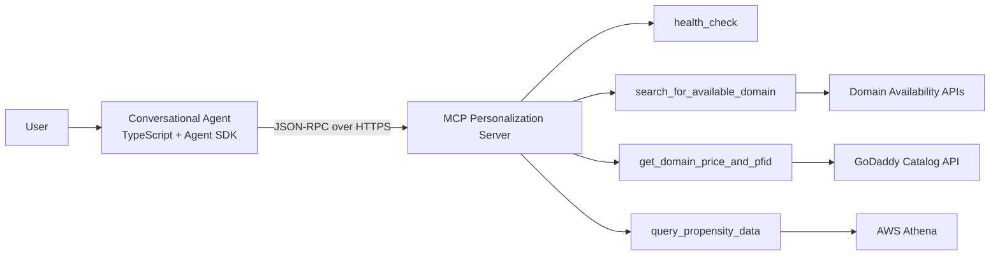
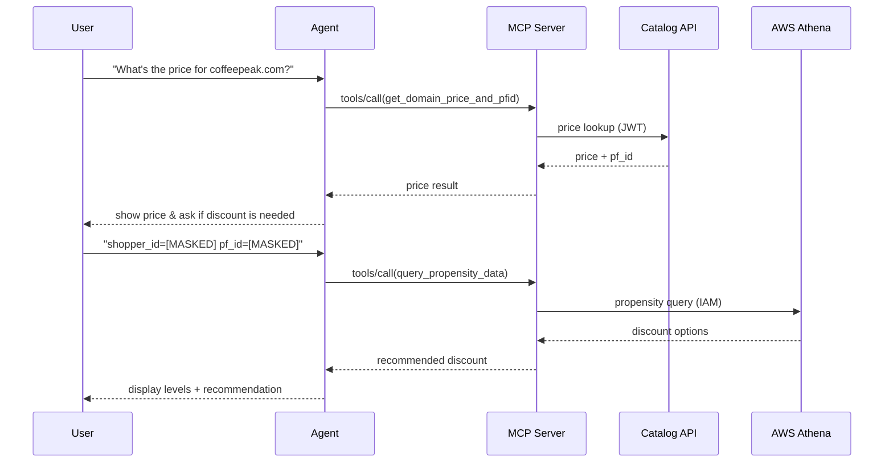

# MCP Personalization Server & Conversational Agent — Project Documentation (v2.3)

**Version:** v2.3  
**Date:** 2025-08-25  
**Audience:** Internal Documentation / Demonstration  
**Owners:** DNAI Team — Contact: Junda (Jayden) Qiu / Subigya Gautam / Ankush Prasad

---

## Table of Contents

1. [Overview / Introduction](#1-overview--introduction)  
2. [Getting Started / Quick Start](#2-getting-started--quick-start)  
3. [User Guide](#3-user-guide)  
4. [API Reference](#4-api-reference)  
5. [Architecture / Design Docs](#5-architecture--design-docs)  
6. [Security & Compliance](#6-security--compliance)  
7. [Development & Contribution Guide](#7-development--contribution-guide)  
8. [Deployment & Ops Guide](#8-deployment--ops-guide)  
9. [Logging & Monitoring](#9-logging--monitoring)  
10. [Performance & Scalability](#10-performance--scalability)  
11. [FAQ / Troubleshooting](#11-faq--troubleshooting)  
12. [Changelog](#12-changelog)  
13. [Roadmap](#13-roadmap)  
14. [Acknowledgements / References](#14-acknowledgements--references)  
15. [License](#15-license)  
16. [Appendices](#16-appendices)

---

## 1. Overview / Introduction

This project integrates a **Conversational AI Agent** (TypeScript + GoDaddy Agent SDK) with an **MCP (Model Context Protocol) Personalization Server** exposing four tools via JSON‑RPC 2.0:

- `search_for_available_domain` — brandable domain suggestions + live availability.  
- `get_domain_price_and_pfid` — real‑time pricing from Catalog API + product family id (pf_id).  
- `query_propensity_data` — discount levels & recommendation via AWS Athena.  
- `health_check` — server health & metrics.

### Goals
- Turn the manual, multi‑tab “search & compare” workflow into a guided **conversational** experience.  
- Provide an **end‑to‑end loop**: idea → available domains → pricing → personalized discounts.

### Value Proposition
- **Users**: brandable domain suggestions via natural language; unified pricing & discount guidance.  
- **Business**: higher conversion with principled discounts; standardized JSON‑RPC makes integration clean and extensible.

### Target Audience
Developers, solution engineers, product/ops, and end users seeking an easy way to connect LLM with other ML models, and for customers seeking intelligent domain recommendations with integrated pricing & negotiatable discounts.

---

## 2. Getting Started / Quick Start

### 2.1 Environment Requirements
- **OS**: Windows / macOS / Linux (**VPN required** for Katana/internal endpoints)  
- **Runtime**: Node.js (LTS), package manager (`npm`, `pnpm`, or `yarn`)  
- **Language**: TypeScript (Agent)  
- **Auth**: GoDaddy **JWT** (pricing), **AWS credentials/role** (propensity)  
- **Network**: Corporate VPN enabled; `*.onkatana.net` resolvable

### 2.2 Minimal Install & Run (Agent)
```bash
# 1) Clone
git clone [INTERNAL_REPO_MASKED]
cd tmp-dnai-mcp-poc-agent

# 2) Install deps
npm install

# 3) Configure env
cp env.example .env
# Edit values as needed (see table below)

# 4) Run
npm run start
```

### 2.3 Environment Variables
| Name | Required | Default | Description |
|---|---|---:|---|
| `MCP_BASE_URL` | yes | — | Katana endpoint, e.g. `[INTERNAL_URL_MASKED] |
| `GODADDY_JWT` | for pricing | — | Bearer JWT required by Catalog pricing tool |
| `AWS_PROFILE` | for propensity | — | AWS profile/role with Athena access |
| `LOG_LEVEL` | no | `info` | `debug` / `info` / `warn` / `error` |
| `DEBUG_VERBOSE` | no | `false` | Extra debug traces (use in dev only) |
| `GODADDY_AI_MODEL` | no | `gpt-4o-mini` | Preferred LLM model id |

### 2.4 Smoke Tests
- **Agent**: type _“I need a domain for my coffee shop”_ after starting.  
- **MCP Health**:
```bash
curl -s -X POST -H "Content-Type: application/json"   -d '{{"jsonrpc":"2.0","id":"1","method":"tools/call","params":{{"name":"health_check","arguments":{{"detailed":true}}}}}}'   "$MCP_BASE_URL/rpc" | jq .
```

### 2.5 Common Installation Issues
| Symptom | Likely Cause | Fix |
|---|---|---|
| Cannot reach Katana | VPN not connected | Connect VPN; confirm `*.onkatana.net` DNS |
| `401 Unauthorized` | Missing/expired JWT | Provide fresh `GODADDY_JWT` |
| Propensity fails | AWS creds/role wrong | Verify `AWS_PROFILE` & Athena permissions |
| TLS errors | Internal certs | Trust corporate certs / configure SSL |

---

## 3. User Guide

### 3.1 Core Scenarios
- **Brainstorm domains** → Agent calls `search_for_available_domain` with transformed keywords (brandability, geography, semantics).  
- **Get pricing** → Agent calls `get_domain_price_and_pfid` (JWT required).  
- **Negotiate discounts** → Agent calls `query_propensity_data` with `shopper_id` + `pf_id` (AWS required).  
- **Check system health** → Agent calls `health_check`.

### 3.2 Conversation Patterns
- **Search Intent**: “I run a mountain hiking blog” → transforms to **summit/peak/trail** and suggests brandable names.  
- **Pricing Intent**: “How much is `coffeepeak.com`?”  
- **Discount Intent**: “Any discount? shopper_id=[MASKED] pf_id=[MASKED]”  
- **Negotiation Intent**: “I’m a startup on a tight budget …” → triggers propensity check.

### 3.3 Best Practices
- Be explicit about **intent** (search vs pricing vs discount).  
- Provide **brand vibe / location** to improve suggestions.  
- Include **`shopper_id` + `pf_id`** for discount queries.

### 3.4 TypeScript Example — JSON‑RPC Call Helper
```ts
import axios from "axios";

export async function callTool(baseUrl: string, name: string, args: any, id = "1") {
  const payload = {
    jsonrpc: "2.0",
    id,
    method: "tools/call",
    params: { name, arguments: args }
  };
  const { data } = await axios.post(`${baseUrl}/rpc`, payload, {
    headers: { "Content-Type": "application/json" }
  });
  return data;
}

// Usage
// await callTool(process.env.MCP_BASE_URL!, "search_for_available_domain", { query: "coffee shop", num_domains: 15 });
```

---

## 4. API Reference

### 4.0 JSON‑RPC Envelope
**POST** `{{MCP_BASE_URL}}/rpc`
```json
{
  "jsonrpc": "2.0",
  "id": "string-or-number",
  "method": "tools/call",
  "params": {
    "name": "<tool_id>",
    "arguments": { /* tool-specific */ }
  }
}
```

### 4.1 `health_check`
**Purpose**: server & tool availability, performance metrics.  
**Request Schema**:
```json
{"type":"object","properties":{"detailed":{"type":"boolean","default":false}}}
```
**Response Example**:
```json
{
  "status":"healthy",
  "timestamp":1755552848.123,
  "uptime_seconds":3600.5,
  "cpu_percent":15.2,
  "memory_usage_mb":72.05,
  "available_tools_count":4,
  "detailed_metrics":{
    "memory_percent":45.2,
    "disk_usage_percent":23.8,
    "available_tools":["health_check","search_for_available_domain","get_domain_price_and_pfid","query_propensity_data"]
  }
}
```

**Troubleshooting**
| Symptom | Cause | Fix |
|---|---|---|
| 503 Service Unavailable | Downstream or server cold start | Retry; verify readiness |
| High memory_percent | Load spike or leak | Scale/restart; inspect heap |

---

### 4.2 `search_for_available_domain`
**Purpose**: brandable domain suggestions + availability check.  
**Request Schema**:
```json
{
  "type":"object","required":["query"],
  "properties":{
    "query":{"type":"string"},
    "num_domains":{"type":"integer","minimum":15,"default":20},
    "tld_list":{"type":"array","items":{"type":"string"},"default":["com","net","org","info","biz","ai","tech"]}
  }
}
```
**Request Example**:
```bash
curl -s -X POST -H "Content-Type: application/json"   -d '{{"jsonrpc":"2.0","id":"2","method":"tools/call","params":{{"name":"search_for_available_domain","arguments":{{"query":"coffee shop","num_domains":15,"tld_list":["com","cafe","shop"]}}}}}}'   "$MCP_BASE_URL/rpc" | jq .
```
**Response Example**:
```json
{
  "available_domains":[{"domain":"techstartup.com","status":"available"}],
  "unavailable_domains":[{"domain":"startup.com","status":"unavailable"}],
  "total_found":15,
  "search_summary":{"query":"tech startup","tlds_used":["com","net","org","ai"],"processing_time":2.3}
}
```

**Troubleshooting**
| Symptom | Cause | Fix |
|---|---|---|
| Empty results | Restrictive TLDs/keywords | Broaden TLDs; rephrase keywords |
| Slow response | Rare TLDs / high `num_domains` | Reduce `num_domains`; use common TLDs |

---

### 4.3 `get_domain_price_and_pfid`
**Purpose**: real-time pricing + pf_id from Catalog API.  
**Auth**: **GODADDY_JWT** required.  
**Request Schema**:
```json
{
  "type":"object","required":["domain_name"],
  "properties":{
    "domain_name":{"type":"string"},
    "currency":{"type":"string","default":"USD","enum":["USD","EUR","GBP","CAD","AUD"]},
    "market_id":{"type":"string","default":"en-US","enum":["en-US","en-CA","en-GB","en-AU","es-ES","fr-FR","de-DE"]},
    "godaddy_jwt":{"type":"string","description":"optional if provided via header/env"}
  }
}
```
**Responses**:
- **Disabled/no JWT**
```json
{"type":"text","text":"Domain pricing tool is currently disabled. Please provide a valid GoDaddy JWT token..."}
```
- **Valid JWT**
```json
{"type":"text","text":"Domain: example.com\nPF_ID: [MASKED]\nPricing:\n  - offerPrice: USD 12.99\n  - discountPrice: USD 9.99\nStatus: Available for pricing"}
```
- **Invalid JWT**
```json
{"type":"text","text":"Error querying pricing for 'example.com': Unauthorized (401): Malformed token"}
```

**Troubleshooting**
| Symptom | Cause | Fix |
|---|---|---|
| 401 Unauthorized | Missing/expired JWT | Refresh and supply new token |
| Price missing | Catalog outage or throttle | Retry with backoff; monitor status |

---

### 4.4 `query_propensity_data`
**Purpose**: discount options & recommendation using AWS Athena.  
**Auth**: AWS IAM with Athena access.  
**Request Schema**:
```json
{
  "type":"object","required":["shopper_id","pf_id"],
  "properties":{
    "shopper_id":{"type":"string","minLength":5,"maxLength":20},
    "pf_id":{"type":"string","minLength":1,"maxLength":15}
  }
}
```
**Response Example**:
```json
{
  "jsonrpc":"2.0",
  "result":{"content":[{"type":"text","text":"Discount Levels Available: 0.0%, 10.0%, 23.3%, 36.7% | Recommended: 36.7%"}]},
  "error":null,
  "id":"66"
}
```

**Troubleshooting**
| Symptom | Cause | Fix |
|---|---|---|
| Access denied | IAM policy/profile | Update role; confirm Athena/Glue/S3 perms |
| No discounts | Edge case | Explain policy; proceed with list price |

---

### 4.5 Global Error Codes
| Code | Meaning | Resolution |
|---|---|---|
| 401 Unauthorized | JWT missing/invalid | Provide valid JWT |
| 403 Forbidden | Permission denied | Fix IAM policy / API perms |
| 404 Not Found | Tool not found | Verify tool name & server |
| 429 Too Many Requests | Rate limited | Exponential backoff |
| 500 Internal Error | Server failure | Retry + inspect logs |
| 503 Service Unavailable | Downstream outage | Retry later |

---

## 5. Architecture / Design Docs

### 5.1 Component Diagram (Mermaid)


### 5.2 Sequence — Pricing + Discount


### 5.3 Design Notes
- JSON‑RPC 2.0; tool registry pattern; intent-driven orchestration.  
- Caching for search; backoff for external APIs; graceful degradation.  
- PII‑safe logs; token redaction; least‑privilege IAM.

---

## 6. Security & Compliance

- **JWT handling**: store in memory; never log; rotate frequently; validate issuer/audience/exp.  
- **AWS**: least‑privilege IAM; scoped to Athena/Glue/S3 datasets only.  
- **Secrets**: use platform secret stores (KMS/Secrets Manager); **do not** commit to VCS.  
- **TLS**: enforce HTTPS; validate cert chains; pin corporate CAs if required.  
- **Logging**: redact tokens/IDs; no PII payloads; rate‑limit error logs to avoid leakage.  
- **Data**: comply with internal data handling policy; purge temporary artifacts.

---

## 7. Development & Contribution Guide

### 7.1 Local Dev
```bash
git clone [INTERNAL_REPO_MASKED]
cd tmp-dnai-mcp-poc-agent
npm install
npm run start
```

### 7.2 Code Structure (sample)
```
src/
├─ agent.ts            # Main agent behavior + prompts
├─ config.ts           # Env parsing / defaults
├─ index.ts            # Entrypoint
└─ utils/
   ├─ logger.ts        # Structured logging
   └─ tokenManager.ts  # JWT handling
```

### 7.3 Standards
- Conventional commits; ESLint/Prettier.  
- Unit tests for intent routing; integration tests for JSON‑RPC.  
- Error handling around **all** external calls; typed return shapes.

### 7.4 PR Process
1. Open an issue for non-trivial changes.  
2. Add tests & docs; update changelog.  
3. Ensure checks pass; request review with context.

---

## 8. Deployment & Ops Guide

### 8.1 CI/CD (GitHub Actions Example)
```yaml
name: CI
on: [push, pull_request]
jobs:
  build:
    runs-on: ubuntu-latest
    steps:
      - uses: actions/checkout@v4
      - uses: actions/setup-node@v4
        with: {{'node-version': '20'}}
      - run: npm ci
      - run: npm run lint && npm run typecheck && npm test -- --ci
      - run: npm run build
```

### 8.2 Docker
```dockerfile
FROM node:20-alpine
WORKDIR /app
COPY package*.json ./
RUN npm ci
COPY . .
CMD ["npm","run","start"]
```

### 8.3 Kubernetes (Sketch)
```yaml
apiVersion: apps/v1
kind: Deployment
metadata: {{'name': 'mcp-agent'}}
spec:
  replicas: 2
  selector: {{'matchLabels': {{'app':'mcp-agent'}}}}
  template:
    metadata: {{'labels': {{'app':'mcp-agent'}}}}
    spec:
      containers:
      - name: agent
        image: registry/mcp-agent:latest
        envFrom:
        - secretRef: {{'name':'mcp-secrets'}}
        - configMapRef: {{'name':'mcp-config'}}
        resources:
          requests: {{'cpu':'200m','memory':'256Mi'}}
          limits: {{'cpu':'500m','memory':'512Mi'}}
```

### 8.4 SLOs & Alerts
- **SLO**: p95 latency < 2s; success rate ≥ 99%; uptime ≥ 99.9%  
- **Alerts**: error rate > 5%/5m; p95 latency > 2s/2m; memory > 85%

### 8.5 Runbooks
- **Catalog outage**: switch to cached price if enabled; surface “price unavailable”; set status page.  
- **Athena slow/deny**: exponential backoff; reduce query scope; notify data team.  
- **JWT failures**: refresh token; verify issuer/audience/scopes.

---

## 9. Logging & Monitoring

### 9.1 Log Fields (JSON)
| Field | Description |
|---|---|
| `timestamp` | ISO8601 time |
| `level` | `debug`/`info`/`warn`/`error` |
| `request_id` | Correlation id |
| `session_id` | Conversation id |
| `user_intent` | Detected intent |
| `tool_name` | Invoked tool |
| `latency_ms` | Execution time |
| `status` | success/failure |
| `error_code` | If any |
| `retries` | Retry count |

**Redaction**: never log JWT, full shopper_id, or PII. Use hashing/masking when needed.

### 9.2 Metrics (Prometheus-like)
- `mcp_tool_requests_total{{tool="..."}}`  
- `mcp_tool_latency_ms_bucket{{tool="..."}}`  
- `mcp_tool_errors_total{{tool="...",code="..."}}`  
- Process CPU/memory; cache hit ratio; uptime.

**Dashboards**: latency heatmap; error breakdown per tool; cache efficiency.  
**Alerts**: see §8.4 thresholds.

---

## 10. Performance & Scalability

- **Caching**: cache availability/pricing by TTL; invalidate on purchase or time‑based.  
- **Concurrency**: bound parallelism per tool; back‑pressure on spikes.  
- **Timeouts**: client/server timeouts per dependency (Catalog/Athena).  
- **Retries**: exponential backoff with jitter for 429/5xx.  
- **Circuit Breakers**: open on repeated failures; graceful fallbacks.  
- **Load Testing**: k6/JMeter scripts; track p50/p90/p95; error percent.

---

## 11. FAQ / Troubleshooting

- **Price unavailable everywhere** → Refresh JWT & check VPN; catalog dependency.  
- **Permission errors on propensity** → Validate AWS role and data source.  
- **Wrong/multiple tools called** → Ensure clear intent; single‑tool logic active.  
- **No discounts** → Valid case; present list price & explain policy.  
- **High latency** → Verify VPN; reduce `num_domains`; check downstream health.

---

## 12. Roadmap

**Short Term**: OpenRPC spec; typed clients; circuit breakers; live dashboards.  
**Mid Term**: i18n; Redis cache; richer personalization; mobile adapter.  
**Long Term**: More TLDs/markets; partner marketplaces; BI analytics; voice interface.

---

## 13. Acknowledgements / References

- GoDaddy Agent SDK; MCP protocol; JSON‑RPC 2.0.  
- Catalog API; Domain Availability APIs; AWS Athena/ML; Katana.  
- Libraries: Express, Axios, Winston, Jest.

---

## 14. License

As defined in the repository. If unspecified, treat as **Internal — GoDaddy Confidential**.

---

## 15. Appendices

### A) Example Prompts
- “I need a domain for an Austin‑based hiking blog.”  
- “Price for `coffeepeak.com` in USD? Market `en‑US`.”  
- “Discount options for `shopper_id=[MASKED]` and `pf_id=[MASKED]`.”

### B) OpenRPC / Swagger Placeholder
```json
{{
  "openrpc": "1.2.6",
  "info": {{"title": "MCP Tools", "version": "0.1.0"}},
  "methods": [
    {{"name":"tools/call","params":[{{"name":"name","schema":{{"type":"string"}}}},{{"name":"arguments","schema":{{"type":"object"}}}}],
     "result":{{"name":"result","schema":{{"type":"object"}}}}}}
  ]
}}
```

### C) Athena Query Skeleton
```sql
SELECT discount, probability
FROM propensity_table
WHERE shopper_id = :shopper_id AND pf_id = :pf_id
ORDER BY probability DESC;
```

### D) IAM Policy Sketch
```json
{{
  "Version": "2012-10-17",
  "Statement": [{{"Effect":"Allow","Action":["athena:*","glue:*","s3:*"],"Resource":"*"}}]
}}
```

### E) Rate Limits & Retries
- 429 ⇒ exponential backoff (jitter).  
- Circuit break on repeated 5xx.  
- Idempotent JSON‑RPC IDs for safe retries.

### F) Glossary
- **pf_id**: product family id (Catalog).  
- **MCP**: Model Context Protocol.  
- **JSON‑RPC**: lightweight RPC over JSON (2.0).
